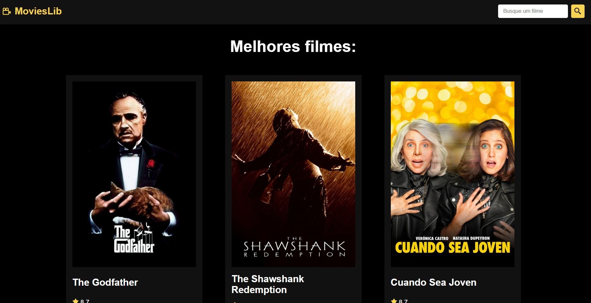

  <a href="#-tecnologias">Tecnologias</a>&nbsp;&nbsp;&nbsp;|&nbsp;&nbsp;&nbsp;
  <a href="#-projeto">Projeto</a>&nbsp;&nbsp;&nbsp;|&nbsp;&nbsp;&nbsp;
  <a href="#memo-licença">Licença</a>

 

  

 

  

## 🚀 Tecnologias

Esse projeto foi desenvolvido com as seguintes tecnologias:

- ReactJs
- JavaScript
- HTML
- CSS
- Vite
- react-router-dom
- react-icons

## 💻 Projeto

MovieLib é uma aplicação que consiste em consumir a API do TMDB para fazer a pesquisa de qualquer filme da plataforma, verificar os detalhes do filme, como orçamento, receita, duração, descrição.

## 📝 Licença

Esse projeto está sob a licença MIT. Veja o arquivo [LICENSE](LICENSE) para mais detalhes.

---

Feito com ♥ by viniciusmaclters :wave:
